# Train with AdamW

## Train Loss

| #   | batch_size | momentum | weight_decay | learning_rate | train loss                                                        |
| --- | ---------- | -------- | ------------ | ------------- | ----------------------------------------------------------------- |
| 1   | 128        | 0.9      | 1e-2         | 1e-3          | 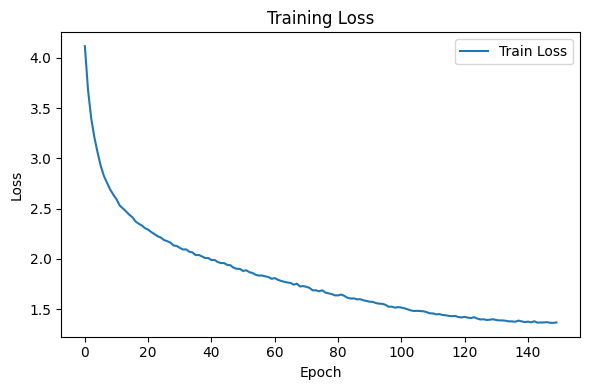 |
| 2   | 128        | 0.9      | 1e-4         | 1e-3          | 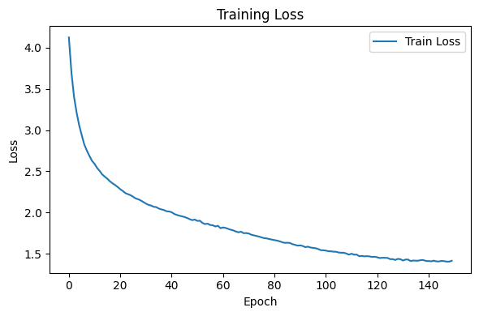 |
| 3   | 128        | 0.9      | 1e-5         | 1e-3          |  |
| 4   | 128        | 0.9      | 5e-4         | 1e-3          | 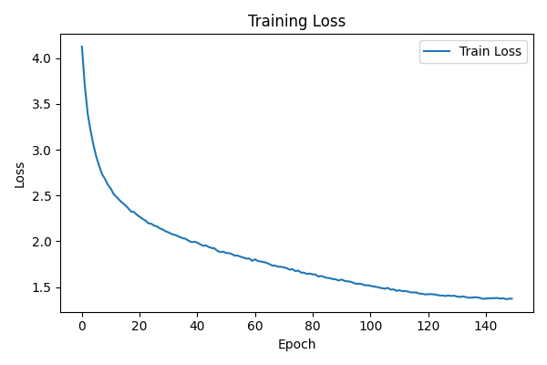 |
| 5   | 128        | 0.9      | 1e-2         | 1e-4          | 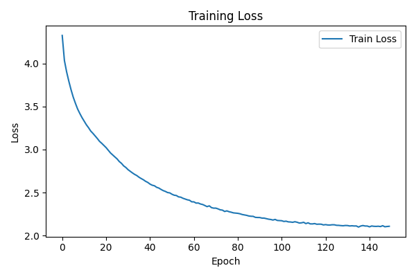 |
| 6   | 128        | 0.9      | 1e-4         | 1e-4          | 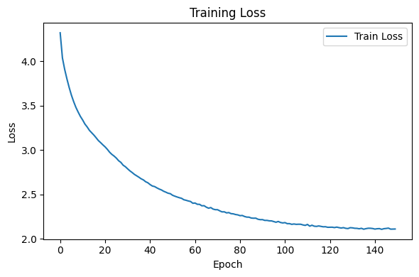 |
|     |            |          |              |               |                                                                   |
|     |            |          |              |               |                                                                   |
|     |            |          |              |               |                                                                   |
|     |            |          |              |               |                                                                   |

## Validation Loss

| #   | batch_size | momentum | weight_decay | learning_rate | validation loss                                                 |
| --- | ---------- | -------- | ------------ | ------------- | --------------------------------------------------------------- |
| 1   | 128        | 0.9      | 1e-2         | 1e-3          | 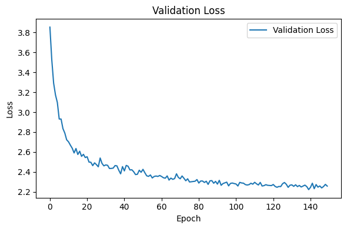 |
| 2   | 128        | 0.9      | 1e-4         | 1e-3          | 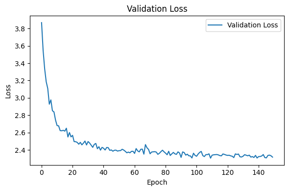 |
| 3   | 128        | 0.9      | 1e-5         | 1e-3          | 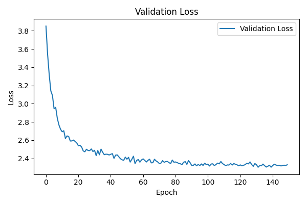 |
| 4   | 128        | 0.9      | 5e-4         | 1e-3          | 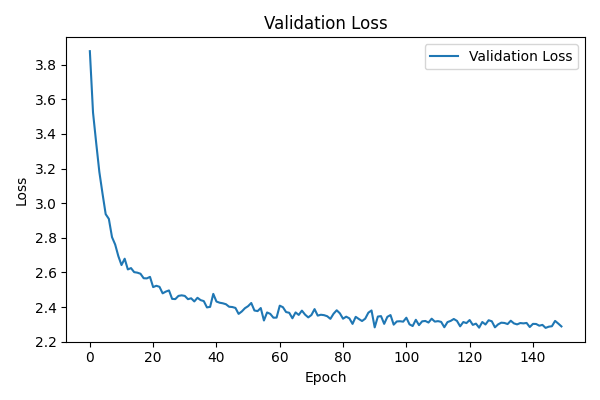 |
| 5   | 128        | 0.9      | 1e-2         | 1e-4          | 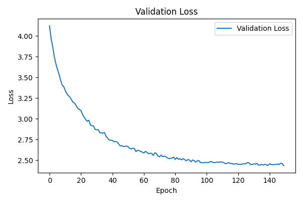 |
| 6   | 128        | 0.9      | 1e-4         | 1e-4          | 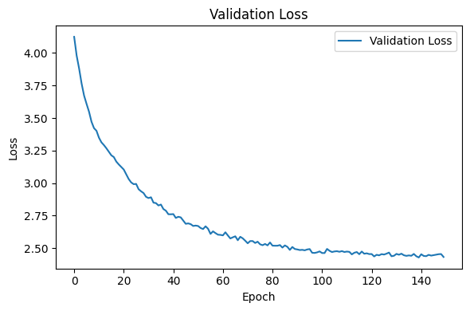 |
|     |            |          |              |               |                                                                 |
|     |            |          |              |               |                                                                 |
|     |            |          |              |               |                                                                 |
|     |            |          |              |               |                                                                 |

## Test Loss

| #   | batch_size | momentum | weight_decay | learning_rate | test loss                                                        |
| --- | ---------- | -------- | ------------ | ------------- | ---------------------------------------------------------------- |
| 1   | 128        | 0.9      | 1e-2         | 1e-3          | 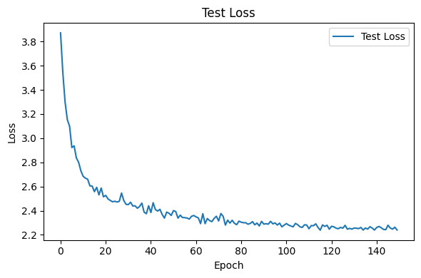 |
| 2   | 128        | 0.9      | 1e-4         | 1e-3          | 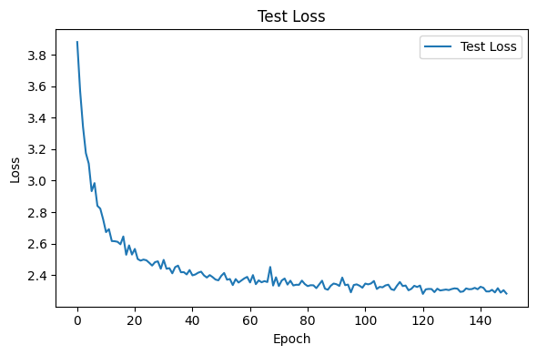 |
| 3   | 128        | 0.9      | 1e-5         | 1e-3          | 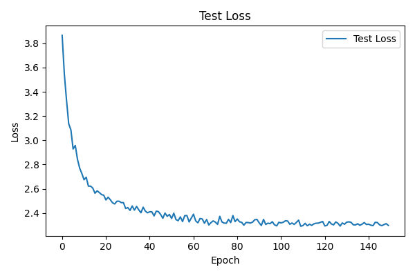 |
| 4   | 128        | 0.9      | 5e-4         | 1e-3          | 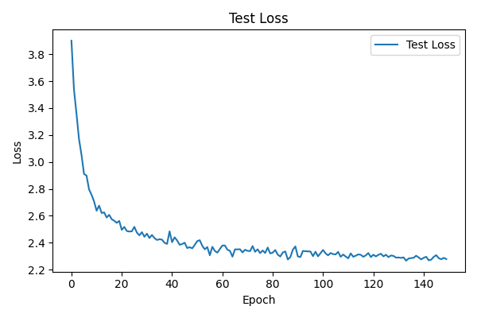 |
| 5   | 128        | 0.9      | 1e-2         | 1e-4          | 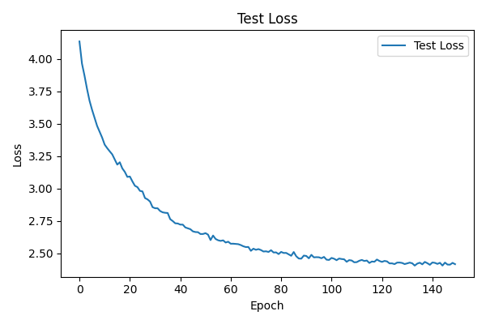 |
| 6   | 128        | 0.9      | 1e-4         | 1e-4          | 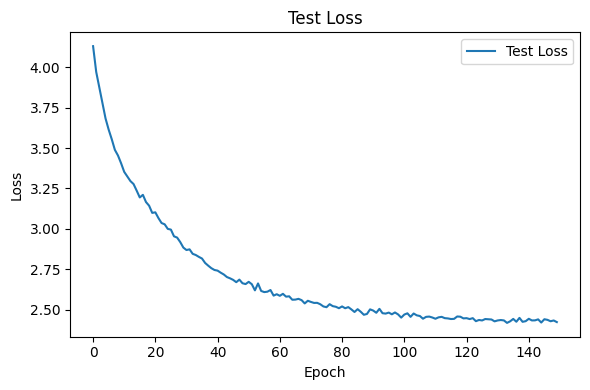 |
|     |            |          |              |               |                                                                  |
|     |            |          |              |               |                                                                  |
|     |            |          |              |               |                                                                  |
|     |            |          |              |               |                                                                  |

## Train Accuracy

| #   | batch_size | momentum | weight_decay | learning_rate | train accuracy                                                        |
| --- | ---------- | -------- | ------------ | ------------- | --------------------------------------------------------------------- |
| 1   | 128        | 0.9      | 1e-2         | 1e-3          | 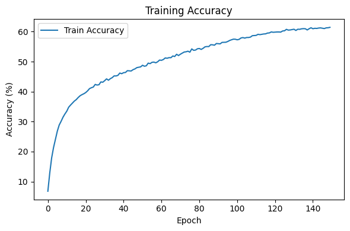 |
| 2   | 128        | 0.9      | 1e-4         | 1e-3          | 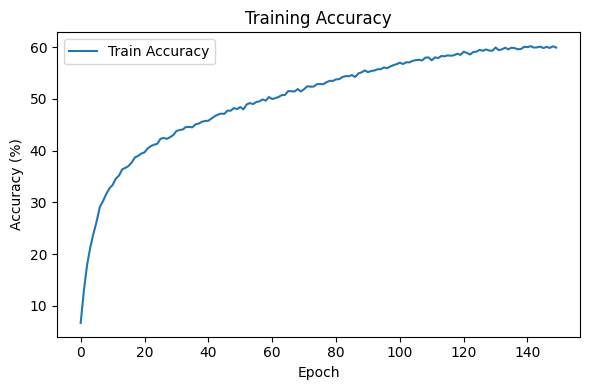 |
| 3   | 128        | 0.9      | 1e-5         | 1e-3          | 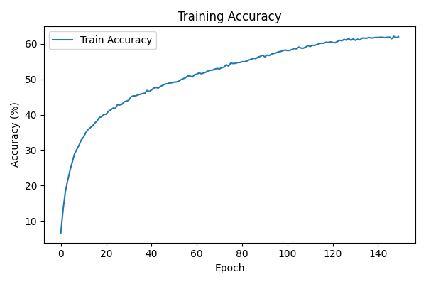 |
| 4   | 128        | 0.9      | 5e-4         | 1e-3          | 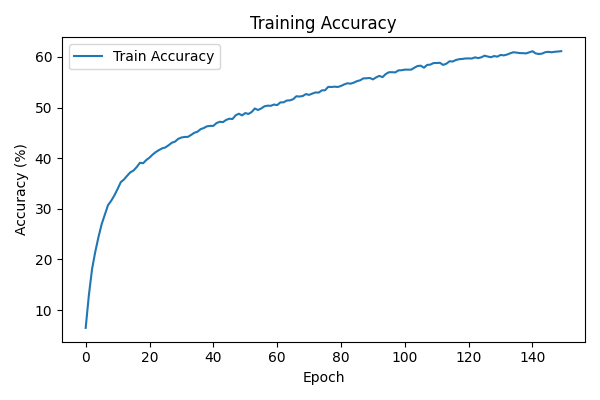 |
| 5   | 128        | 0.9      | 1e-2         | 1e-4          | 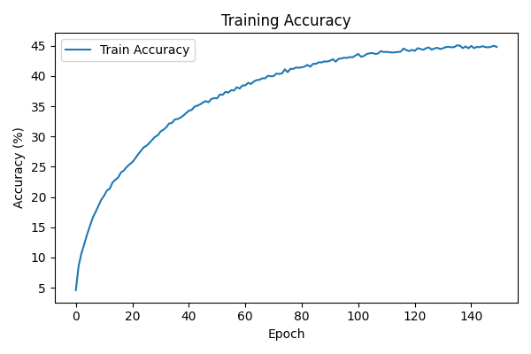 |
| 6   | 128        | 0.9      | 1e-4         | 1e-4          | 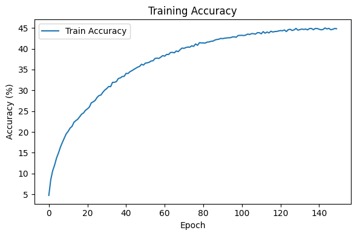 |
|     |            |          |              |               |                                                                       |
|     |            |          |              |               |                                                                       |
|     |            |          |              |               |                                                                       |
|     |            |          |              |               |                                                                       |

## Validation Accuracy

| #   | batch_size | momentum | weight_decay | learning_rate | validation accuracy                                                 |
| --- | ---------- | -------- | ------------ | ------------- | ------------------------------------------------------------------- |
| 1   | 128        | 0.9      | 1e-2         | 1e-3          | 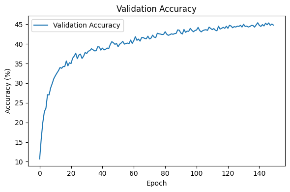 |
| 2   | 128        | 0.9      | 1e-4         | 1e-3          | 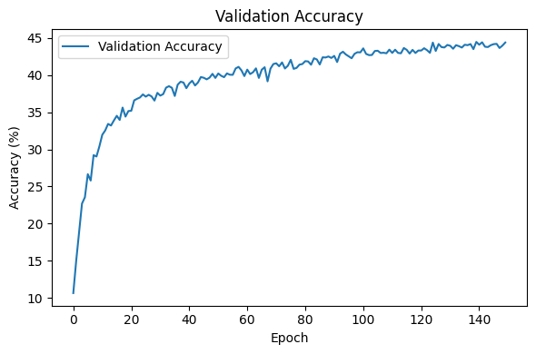 |
| 3   | 128        | 0.9      | 1e-5         | 1e-3          | 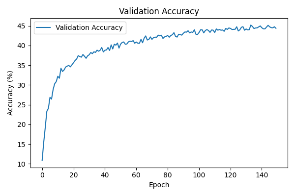 |
| 4   | 128        | 0.9      | 5e-4         | 1e-3          | 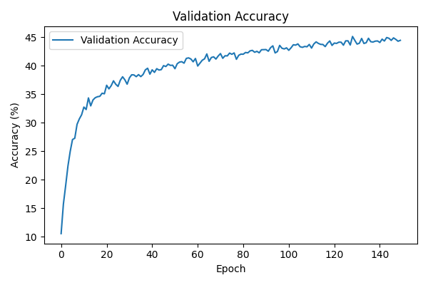 |
| 5   | 128        | 0.9      | 1e-2         | 1e-4          | 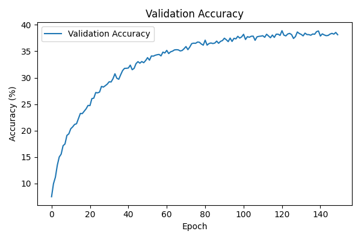 |
| 6   | 128        | 0.9      | 1e-4         | 1e-4          | 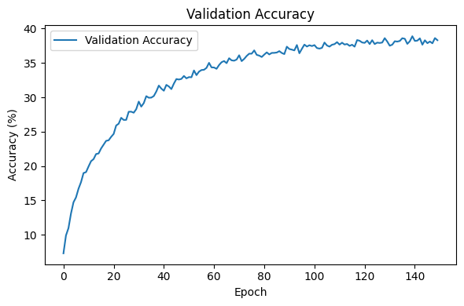 |
|     |            |          |              |               |                                                                     |
|     |            |          |              |               |                                                                     |
|     |            |          |              |               |                                                                     |
|     |            |          |              |               |                                                                     |

## Test Accuracy

| #   | batch_size | momentum | weight_decay | learning_rate | test accuracy                                                        |
| --- | ---------- | -------- | ------------ | ------------- | -------------------------------------------------------------------- |
| 1   | 128        | 0.9      | 1e-2         | 1e-3          | 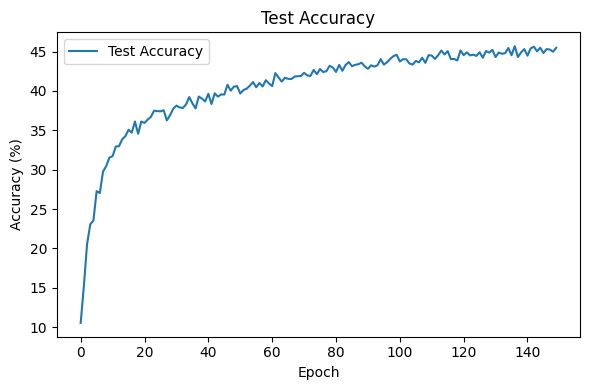 |
| 2   | 128        | 0.9      | 1e-4         | 1e-3          | 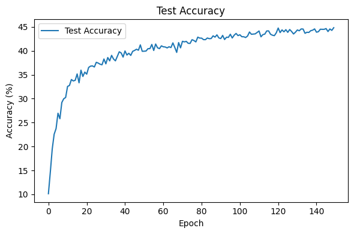 |
| 3   | 128        | 0.9      | 1e-5         | 1e-3          | 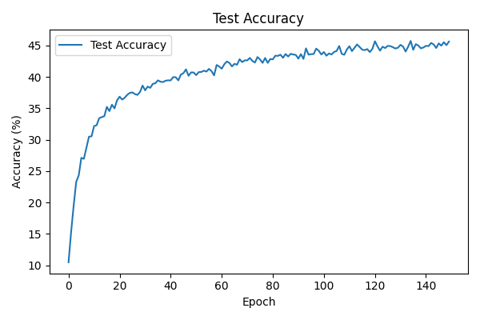 |
| 4   | 128        | 0.9      | 5e-4         | 1e-3          | 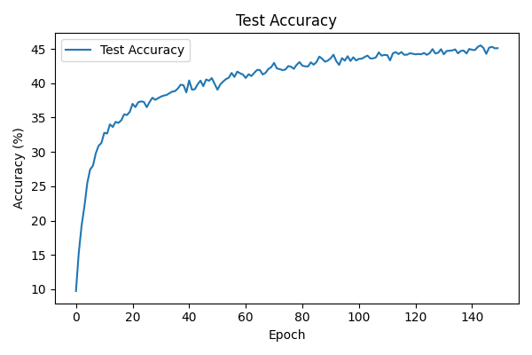 |
| 5   | 128        | 0.9      | 1e-2         | 1e-4          | 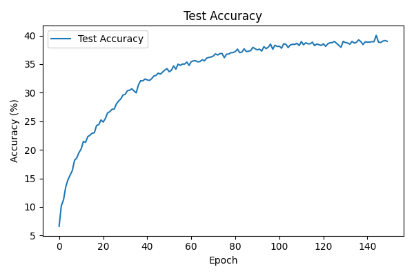 |
| 6   | 128        | 0.9      | 1e-4         | 1e-4          | 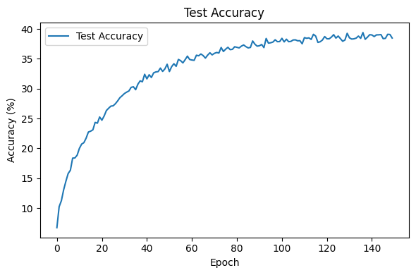 |
|     |            |          |              |               |                                                                      |
|     |            |          |              |               |                                                                      |
|     |            |          |              |               |                                                                      |
|     |            |          |              |               |                                                                      |
